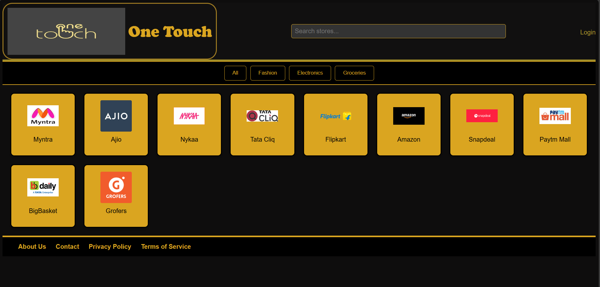

# One Touch - Indian Shopping 

**One Touch - Indian Shopping** is a streamlined web application designed to provide users with a single-click access to various popular shopping websites in India. The project presents a clean, professional interface with gold and black accents, making it easy and elegant to navigate between shopping platforms quickly. This project is built using HTML, CSS, and JavaScript, focusing on user-friendly design and efficiency.

## Table of Contents
- [Project Overview](#project-overview)
- [Features](#features)
- [Technologies Used](#technologies-used)
- [Getting Started](#getting-started)
- [Usage](#usage)
- [Contributing](#contributing)
- [License](#license)

## Project Overview
**One Touch - Indian Shopping** is a one-stop solution for accessing various shopping websites with a single click. The header is optimized for easy navigation, and an interactive login overlay is implemented to ensure a smooth user experience. The goal is to create a seamless shopping journey by consolidating links to all major shopping sites in one place.

## Features
- **Quick Access to Shopping Sites**: Directs users to popular shopping websites with one click.
- **Professional Design**: Clean, modern interface with gold and black theme.
- **Responsive Header**: Easy navigation with a user-friendly header.
- **Login Overlay**: Simple login overlay to improve user accessibility.

## Technologies Used
- **HTML**: Structure and layout of the web page.
- **CSS**: Styling, including the gold and black theme.
- **JavaScript**: Adds interactivity, especially for the login overlay.

## Getting Started
To get a local copy up and running, follow these steps:

### Prerequisites
- Web browser (e.g., Chrome, Firefox, Safari)
- Code editor (e.g., VSCode, Sublime Text)

### Installation
1. **Clone the repository**:
   ```bash
   git clone https://github.com/wizard2305/One-Touch---All-In-One-Shopping.git
   ```
2. **Navigate to the project directory**:
   ```bash
   cd One-Touch---All-In-One-Shopping
   ```
3. **Open the project in your preferred code editor**.

4. **Run the HTML file**:
   Open `ALL IN ONE SHOPPING.html` in a web browser to view the project locally.

## Usage
1. Open the **One Touch - Indian Shopping** website.
2. Click on the logo of the shopping site you wish to visit.
3. Use the login overlay if you want to customize your experience.
4. Enjoy one-click access to India’s popular shopping platforms!

## Contributing
Contributions are welcome! To contribute:
1. Fork the project.
2. Create your feature branch (`git checkout -b feature/AmazingFeature`).
3. Commit your changes (`git commit -m 'Add some AmazingFeature'`).
4. Push to the branch (`git push origin feature/AmazingFeature`).
5. Open a Pull Request.

## License
This project is licensed under the MIT License.

---

